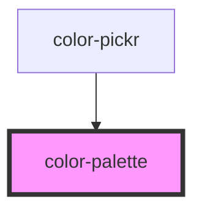

# color-palette

<!-- Auto Generated Below -->

## Properties

| Property | Attribute | Description                                                                        | Type     | Default     |
| -------- | --------- | ---------------------------------------------------------------------------------- | -------- | ----------- |
| `color`  | `color`   | The color that is being displayed. This currently *MUST* be in 6 digit hex format. | `string` | `undefined` |

## Events

| Event                | Description                                        | Type                     |
| -------------------- | -------------------------------------------------- | ------------------------ |
| `colorPaletteChange` | Emitted during dragging and when the color changes | `CustomEvent<HSVaColor>` |

## Methods

### `setColor(color: string) => Promise<void>`

Sets the color. Must pass through a hex value

#### Returns

Type: `Promise<void>`

### `setHue(hue: number) => Promise<void>`

Set the hue ONLY on color palette

#### Returns

Type: `Promise<void>`

## Dependencies

### Used by

 - [color-pickr](../color-pickr)

### Graph

----------------------------------------------

*Built with [StencilJS](https://stenciljs.com/)*
