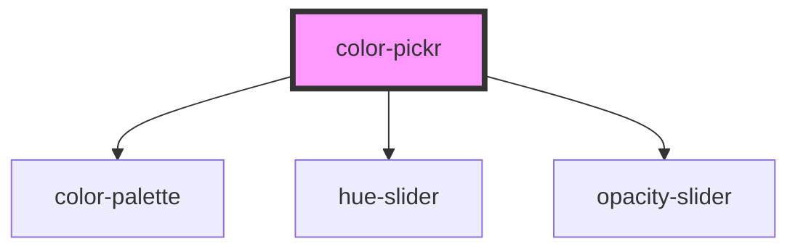

# color-pickr

<!-- Auto Generated Below -->

## Properties

| Property            | Attribute             | Description                                                                                                   | Type              | Default           |
| ------------------- | --------------------- | ------------------------------------------------------------------------------------------------------------- | ----------------- | ----------------- |
| `color`             | `color`               | The color that is being displayed. This currently **MUST** be in 6 digit hex format                           | `string`          | `undefined`       |
| `maxPresetDisplay`  | `max-preset-display`  | Max number of preset palettes to display                                                                      | `number`          | `50`              |
| `opacity`           | `opacity`             | Whether opacity is supported on this instance.                                                                | `boolean`         | `undefined`       |
| `palettes`          | `palettes`            | A JSON formatted string of palettes, or an Array if being passed through programmatically. Example of format: | `any[] \| string` | `undefined`       |
| `recentColorsLabel` | `recent-colors-label` | The label that corresponds to the group of palettes for your recent colors                                    | `string`          | `'Recent Colors'` |

## Events

| Event         | Description                                    | Type                     |
| ------------- | ---------------------------------------------- | ------------------------ |
| `colorChange` | Emitted when a color or the opacity is changed | `CustomEvent<HSVaColor>` |

## Methods

### `addToPreset(hex: string, label: string) => Promise<void>`

Add a single color the list of preset palettes. If the label already exists it will be added to the start. If it doesn't exist, a new section will be created.

#### Returns

Type: `Promise<void>`

## Dependencies

### Depends on

- [color-palette](../color-palette)
- [hue-slider](../hue-slider)
- [opacity-slider](../opacity-slider)

### Graph

----------------------------------------------

*Built with [StencilJS](https://stenciljs.com/)*
