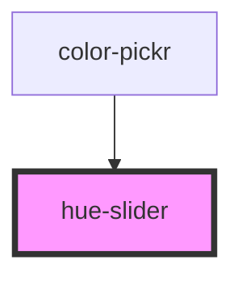

# hue-slider

<!-- Auto Generated Below -->

## Properties

| Property | Attribute | Description                                                                        | Type     | Default     |
| -------- | --------- | ---------------------------------------------------------------------------------- | -------- | ----------- |
| `color`  | `color`   | The color that is being displayed. This currently *MUST* be in 6 digit hex format. | `string` | `undefined` |

## Events

| Event       | Description                                                | Type                  |
| ----------- | ---------------------------------------------------------- | --------------------- |
| `hueChange` | Emitted when the hue has changed. Emits only the Hue value | `CustomEvent<number>` |

## Methods

### `setHue(hue: number) => Promise<void>`

Sets the hue value

#### Returns

Type: `Promise<void>`

## Dependencies

### Used by

 - [color-pickr](../color-pickr)

### Graph

----------------------------------------------

*Built with [StencilJS](https://stenciljs.com/)*
