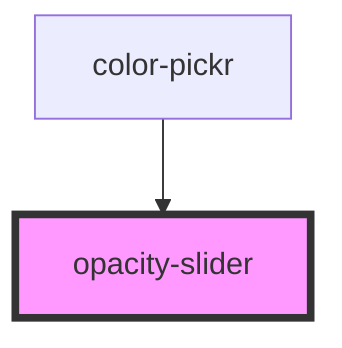

# opacity-slider

<!-- Auto Generated Below -->

## Properties

| Property  | Attribute | Description                                                                        | Type     | Default     |
| --------- | --------- | ---------------------------------------------------------------------------------- | -------- | ----------- |
| `color`   | `color`   | The color that is being displayed. This currently *MUST* be in 6 digit hex format. | `string` | `'#000000'` |
| `opacity` | `opacity` | The starting opacity value form 0 - 100                                            | `number` | `undefined` |

## Events

| Event           | Description                                 | Type                  |
| --------------- | ------------------------------------------- | --------------------- |
| `opacityChange` | Emitted when the opacity slider has changed | `CustomEvent<number>` |

## Methods

### `setColor(color: string) => Promise<void>`

Sets the color for the slider

#### Returns

Type: `Promise<void>`

### `setOpacity(opacity: number) => Promise<void>`

Sets te opacity for the slider

#### Returns

Type: `Promise<void>`

## Dependencies

### Used by

 - [color-pickr](../color-pickr)

### Graph

----------------------------------------------

*Built with [StencilJS](https://stenciljs.com/)*
